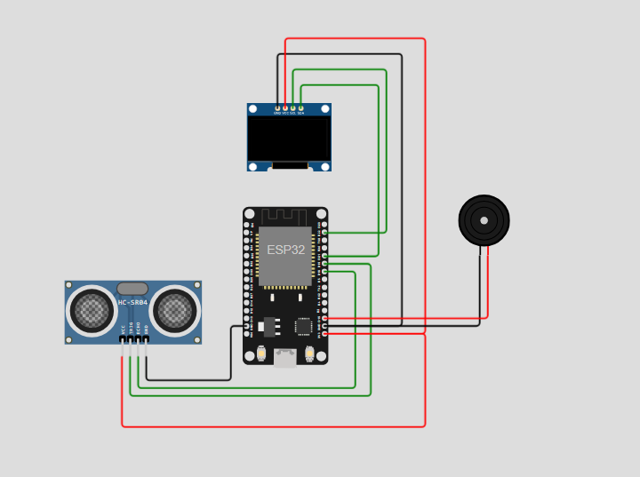

# Alerta de Enchentes - Stack-Society 2025



## Descrição

Nosso projeto “Alerta de Enchentes” foi desenvolvido como uma solução de monitoramento residencial utilizando um sensor ultrassônico conectado. O sistema detecta níveis de risco com base nas ondas sonoras captadas pelo sensor, faz os cálculos e retorna ao usuário a distância exata do nível da água. Esse valor é enviado a uma máquina virtual, e pode ser requisitada tanto na aplicação POSTMAN, quanto no código Python de Gráfico.

## Tecnologias Utilizadas

- ESP32 DevKit v1
- Wokwi (simulador)
- Display OLED
- Buzzer
- Docker + Fiware
- Azure VM
- Python + Dash + Plotly
- Postman (requisições HTTP)
- MQTT (Protocolo de comunicação)

## Fluxograma


## Passo a Passo

1. Inicie sua VM e acesse via terminal/CMD.
2. Entre na pasta do Fiware com `cd nome_da_pasta`.
3. Execute `sudo docker-compose up -d` para subir os containers.
4. Realize um Health Check no Postman.
5. Acesse o projeto no Wokwi, altere os IDs e IPs no código.
6. Inicie o simulador Wokwi e aguarde a conexão com Wi-Fi e MQTT.
7. Os valores serão apresentados no serial monitor e na tela I2C do simulador.
8. Abra o VSCode ou Google Colab e cole o código Python (também atualize os IPs/IDs).

- Pronto. Você terá os valores em metros calculados pelo sistema, e os valores serão apresentados no serial monitor e na tela OLED do simulador.
---

## Código - DashBoard em Python

```python
import dash
from dash import dcc, html
from dash.dependencies import Input, Output, State
import plotly.graph_objs as go
import requests
from datetime import datetime
import pytz

# Stack-Society 2025

# Endereço IP da máquina virtual onde está rodando o serviço STH (Short-Term Historic)
ENDERECO_IP = "20.64.236.3"  # Altere para o IP da sua VM
PORTA_STH = 8666  # Porta do serviço STH
HOST_DASH = "127.0.0.1"  # Host onde o Dash vai rodar (localhost)

# Função para buscar os dados de enchente do serviço STH
def buscar_enchente(qtd_registros):
    # Monta a URL para pegar os últimos N registros do atributo 'enchente' da entidade Lamp
    url = f"http://{ENDERECO_IP}:{PORTA_STH}/STH/v1/contextEntities/type/Lamp/id/urn:ngsi-ld:stack-enchente:001/attributes/enchente?lastN={qtd_registros}"
    cabecalhos = {
        'fiware-service': 'smart',    # Header obrigatório para FIWARE
        'fiware-servicepath': '/'     # Caminho do serviço FIWARE
    }
    resposta = requests.get(url, headers=cabecalhos)  # Faz a requisição GET
    if resposta.status_code == 200:
        dados = resposta.json()  # Converte a resposta para JSON
        try:
            # Extrai a lista de valores retornada do JSON
            valores = dados['contextResponses'][0]['contextElement']['attributes'][0]['values']
            return valores
        except KeyError as erro:
            print(f"Erro de chave: {erro}")  # Caso a estrutura do JSON mude ou não tenha a chave
            return []
    else:
        print(f"Erro ao acessar {url}: {resposta.status_code}")  # Caso a requisição falhe
        return []

# Função para converter timestamps em UTC para horário de São Paulo
def converter_para_sao_paulo(lista_timestamps):
    fuso_utc = pytz.utc
    fuso_sp = pytz.timezone('America/Sao_Paulo')
    timestamps_convertidos = []
    for tempo in lista_timestamps:
        try:
            # Remove o 'T' e 'Z' do timestamp para facilitar o parsing
            tempo = tempo.replace('T', ' ').replace('Z', '')
            # Tenta converter com milissegundos
            convertido = fuso_utc.localize(datetime.strptime(tempo, '%Y-%m-%d %H:%M:%S.%f')).astimezone(fuso_sp)
        except ValueError:
            # Caso não tenha milissegundos, tenta outra formatação
            convertido = fuso_utc.localize(datetime.strptime(tempo, '%Y-%m-%d %H:%M:%S')).astimezone(fuso_sp)
        timestamps_convertidos.append(convertido)
    return timestamps_convertidos

# Recebe do usuário quantos dados ele quer requisitar
lastn = int(input('Quantos dados você deseja requisitar:'))

# Inicializa o app Dash
app = dash.Dash(__name__)

# Layout da aplicação, com título, gráfico, armazenamento local e temporizador de atualização
app.layout = html.Div([
    html.H1('Visualizador de Enchente'),  # Título da página
    dcc.Graph(id='grafico-enchente'),     # Gráfico que vai mostrar o nível de enchente
    dcc.Store(id='store-enchente', data={'timestamps': [], 'valores_enchente': []}),  # Armazena dados localmente
    dcc.Interval(
        id='intervalo-atualizacao',
        interval=10*1000,  # Intervalo de atualização a cada 10 segundos (em milissegundos)
        n_intervals=0
    )
])

# Callback que atualiza os dados do nível de enchente a cada intervalo de tempo
@app.callback(
    Output('store-enchente', 'data'),   # Atualiza o armazenamento local com novos dados
    Input('intervalo-atualizacao', 'n_intervals'),  # Disparado a cada intervalo definido
    State('store-enchente', 'data')     # Pega os dados atuais armazenados
)
def atualizar_dados(n_intervals, dados_enchente):
    dados = buscar_enchente(lastn)  # Busca os últimos dados do serviço
    if dados:
        # Extrai os valores numéricos do nível da enchente
        valores = [float(item['attrValue']) for item in dados]
        # Extrai os timestamps recebidos
        tempos = [item['recvTime'] for item in dados]
        # Converte os timestamps para horário de São Paulo
        tempos = converter_para_sao_paulo(tempos)
        # Adiciona os novos dados na lista existente (acumula)
        dados_enchente['timestamps'].extend(tempos)
        dados_enchente['valores_enchente'].extend(valores)
    return dados_enchente  # Retorna os dados atualizados para o armazenamento

# Callback que atualiza o gráfico sempre que os dados no armazenamento mudam
@app.callback(
    Output('grafico-enchente', 'figure'),  # Atualiza o gráfico
    Input('store-enchente', 'data')        # Quando os dados são atualizados
)
def atualizar_grafico(dados_enchente):
    if dados_enchente['timestamps'] and dados_enchente['valores_enchente']:
        # Cria a linha do gráfico com os dados coletados
        curva_enchente = go.Scatter(
            x=dados_enchente['timestamps'],        # Eixo X: horários convertidos
            y=dados_enchente['valores_enchente'],  # Eixo Y: nível da enchente
            mode='lines+markers',                   # Mostra linha e pontos
            name='Enchente',
            line=dict(color='royalblue')            # Cor da linha
        )
        # Configura o layout do gráfico com títulos e hover
        figura = go.Figure(data=[curva_enchente])
        figura.update_layout(
            title='Nível de Enchente ao Longo do Tempo',
            xaxis_title='Horário',
            yaxis_title='Nível de Enchente',
            hovermode='closest'  # Mostra o ponto mais próximo ao passar o mouse
        )
    else:
        # Caso não tenha dados, retorna figura vazia
        figura = go.Figure()
    return figura

# Ponto de entrada para rodar o app Dash
if __name__ == '__main__':
    app.run(debug=True, host=HOST_DASH, port=8050)


```

## Código - ESP32 (C++)

```cpp
#include <Wire.h>
#include <Adafruit_GFX.h>
#include <Adafruit_SSD1306.h>
#include <WiFi.h>
#include <PubSubClient.h>

// Definições do display OLED
#define SCREEN_WIDTH 128
#define SCREEN_HEIGHT 64
#define OLED_RESET    -1
Adafruit_SSD1306 display(SCREEN_WIDTH, SCREEN_HEIGHT, &Wire, OLED_RESET);

// Definições dos pinos do ultrassônico
const int trigPin = 19;  // D19
const int echoPin = 18;  // D18

// Definição do pino do buzzer
const int buzzerPin = 15;

// Variáveis para medição
long duration;
float distance;

// Faixas de risco (ajuste conforme seu cenário)
const float limiteSeguro = 100;   // Até 100 cm
const float limiteAlerta = 50;    // De 50 a 100 cm
// Abaixo de 50 cm é crítico

// === Configurações de rede e mqtt === //
const char* ssid = "Wokwi-GUEST";
const char* password = "";

// === Configurações MQTT ===
const char* broker = "20.64.236.3";
const int brokerPort = 1883;
const char* topicoPublish = "/TEF/stack-enchente001/attrs/e";
const char* idMQTT = "stack-enchente001";

// === Instâncias dos clientes Wi-Fi e MQTT
WiFiClient espClient;
PubSubClient client(espClient);

// === Conectar à rede Wi-Fi ===
void initWiFi() {
  WiFi.begin(ssid, password);
  Serial.print("Conectando ao Wi-Fi");
  while (WiFi.status() != WL_CONNECTED) {
    delay(500);
    Serial.print(".");
  }
  Serial.println("\nConectado ao Wi-Fi!");
}

void reconnectMQTT() {
  while (!client.connected()) {
    Serial.print("Conectando ao Broker MQTT...");
    if (client.connect(idMQTT)) {
      Serial.println("Conectado ao broker!");
    } else {
      Serial.print("Falha, rc=");
      Serial.println(client.state());
      Serial.println("Tentando novamente em 2s");
      delay(2000);
    }
  }
}

void setupMQTT() {
  client.setServer(broker, brokerPort);
}

void setup() {
  Serial.begin(115200);

  initWiFi();
  setupMQTT();

  // Inicializa o display
  if(!display.begin(SSD1306_SWITCHCAPVCC, 0x3C)) { 
    Serial.println(F("Falha no display SSD1306"));
    for(;;); // Travar
  }

  display.clearDisplay();
  display.setTextSize(1);
  display.setTextColor(SSD1306_WHITE);
  display.setCursor(0,0);
  display.println("Monitor de Nivel");
  display.println("Iniciando...");
  display.display();
  delay(2000);

  // Configura pinos do sensor e buzzer
  pinMode(trigPin, OUTPUT);
  pinMode(echoPin, INPUT);
  pinMode(buzzerPin, OUTPUT);
}

void enviarResultado() {
  client.publish(topicoPublish, String(distance).c_str());
}

void loop() {

  if (!client.connected()) {
    reconnectMQTT();
  }
  client.loop();
  
  // Envia pulso
  digitalWrite(trigPin, LOW);
  delayMicroseconds(2);
  digitalWrite(trigPin, HIGH);
  delayMicroseconds(10);
  digitalWrite(trigPin, LOW);

  // Mede o tempo de retorno
  duration = pulseIn(echoPin, HIGH);

  // Calcula a distancia (em cm)
  distance = duration * 0.034 / 2;
  enviarResultado();

  // Exibe no Serial Monitor
  Serial.print("Distancia: ");
  Serial.print(distance);
  Serial.println(" cm");

  // Determina o status do nível
  String status = "";

  if(distance > limiteSeguro) {
    status = "SEGURO";
    noTone(buzzerPin);  // buzzer desligado
  } else if(distance <= limiteSeguro && distance > limiteAlerta) {
    status = "ALERTA";
    // Buzzer intermitente: liga 200ms, desliga 800ms
    tone(buzzerPin, 1000);  // tom 1000Hz
    delay(200);
    noTone(buzzerPin);
    delay(800);
  } else {
    status = "CRITICO";
    // Buzzer ligado contínuo com tom mais alto
    tone(buzzerPin, 2000); // tom 2000Hz
    delay(1000);
  }

  // Mostra no display OLED
  display.clearDisplay();

  // Texto do nível
  display.setTextSize(2);
  display.setCursor(0,0);
  display.println("Nivel:");

  // Distancia
  display.setTextSize(2);
  display.setCursor(0,20);
  display.print(distance, 0);
  display.println(" cm");

  // Status
  display.setTextSize(2);
  display.setCursor(0, 45);
  display.setTextColor(SSD1306_WHITE);
  display.println(status);

  display.display();
}
```

## Link do simulador

- https://wokwi.com/projects/433043378372585473


## Autores
**Stack-Society** 
- Vitor de Lima Domingues(RM561008)
- Giovanni Romano Provazi(RM560434)
- João Pedro Vieira de Morais(RM56257)